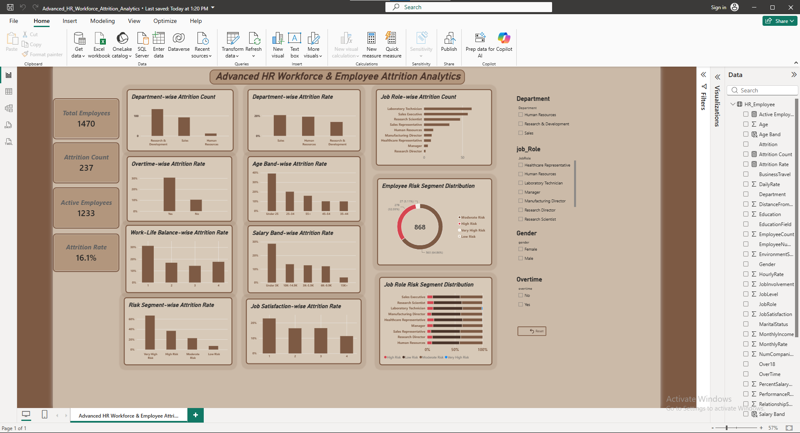

# Advanced HR Workforce & Employee Attrition Analytics

<p align="left">
  
  
  
  
  
</p>

## 🧭 Executive Summary

An end-to-end HR analytics project that turns the IBM HR Employee Attrition dataset (1,470 employees) into a structured, decision-ready analysis. Using **Python** for cleaning and feature engineering, **PostgreSQL/SQL** for structured analysis, and **Power BI + DAX** for an interactive dashboard, the project surfaces a **16.1% overall attrition rate**, with attrition concentrated among employees who work overtime (30.53%), have low job satisfaction, or are in their first 2 years of tenure (29.82%). A custom **Employee Risk Score** segments the workforce into Low → Very High risk groups to help prioritize where HR should investigate further.

## 📊 Project Overview

This project delivers an **end-to-end HR analytics solution** that analyzes workforce composition, employee attrition, employee experience, career progression, compensation, workload, and retention-related patterns.

The analysis follows a complete analytics pipeline:

**Python → PostgreSQL → SQL Analytics → Power BI → DAX → Business Insights**

The work is built on the publicly available **IBM HR Analytics Employee Attrition & Performance** dataset (1,470 employee records, 35 original attributes) — a fictional benchmark dataset, not real company data. The goal is to demonstrate how raw HR data can be transformed into structured analysis, interactive dashboards, and actionable business insights.

---

## 📑 Table of Contents

- [Executive Summary](#-executive-summary)
- [Business Objectives](#-business-objectives)
- [Project Structure](#️-project-structure)
- [Technology Stack](#-technology-stack)
- [Dataset](#-dataset)
- [Python Analysis](#-python-analysis)
- [Key Analytical Findings](#-key-analytical-findings)
- [Employee Risk Segmentation](#-employee-risk-segmentation)
- [Correlation Analysis](#-correlation-analysis)
- [PostgreSQL & SQL Analytics](#-postgresql--sql-analytics)
- [Power BI Dashboard](#-power-bi-dashboard)
- [DAX Measures](#-dax-measures)
- [Analytical Workflow](#️-analytical-workflow)
- [Business Insights](#-business-insights)
- [Analytical Limitations](#️-analytical-limitations)
- [Skills Demonstrated](#-skills-demonstrated)
- [Author](#-author)
- [License](#-license)

---

## 🎯 Business Objectives

This project addresses key HR and workforce analytics questions:

- What does the overall workforce composition look like?
- What is the observed employee attrition rate?
- Which departments and job roles show higher observed attrition?
- How does overtime relate to employee attrition?
- How do job satisfaction and work-life balance relate to attrition?
- How do age and tenure relate to employee turnover?
- How does compensation vary across departments and job roles?
- How does career progression relate to attrition patterns?
- Which employee segments show higher observed retention risk?
- How can HR teams use data to prioritize areas for further investigation?

> **Note:** This analysis identifies associations and observed patterns in the data. It does not establish causal relationships.

---

## 🗂️ Project Structure

```text
HR-Analytics-Advanced/
│
├── data/
│   ├── raw/
│   │   └── WA_Fn-UseC_-HR-Employee-Attrition.csv
│   └── processed/
│       └── HR_Employee_Attrition_Cleaned.csv
│
├── notebooks/
│   └── 01_data_understanding.ipynb
│
├── sql/
│   └── 04_advanced_analysis.sql
│
├── powerbi/
│   ├── Advanced_HR_Workforce_Attrition_Analytics.pbix
│   └── screenshots/
│       └── PowerBI-Dashboard.png
│
└── README.md
```

---

## 🧰 Technology Stack

| Technology   | Purpose                                     |
|--------------|----------------------------------------------|
| Python       | Data cleaning, EDA, and feature engineering |
| Pandas       | Data manipulation and analysis              |
| NumPy        | Numerical operations                        |
| PostgreSQL   | Relational database and SQL analytics       |
| SQL          | Workforce and attrition analysis            |
| Power BI     | Interactive dashboard and visualization     |
| DAX          | KPI calculations and analytical measures    |
| Git & GitHub | Version control and portfolio documentation |

---

## 📁 Dataset

**Source:** IBM HR Analytics Employee Attrition & Performance

The dataset includes:

- 1,470 employee records
- 35 original columns
- Employee demographics
- Department and job role information
- Compensation details
- Job satisfaction, environment satisfaction, and job involvement
- Work-life balance and overtime status
- Career progression and company tenure
- Employee attrition status

> **Important:** This is a fictional/public benchmark dataset widely used for HR analytics practice and portfolio projects. It should not be interpreted as confidential or real-world employee data from any organization.

---

## 🐍 Python Analysis

Python served as the first analytical layer of the project.

### 1. Data Understanding
A full data audit covering dimensions, data types, missing values, duplicates, unique values, numerical summaries, categorical variables, constant columns, and integrity checks.

```text
Rows: 1,470
Columns: 35
```

### 2. Data Quality Checks
Internal consistency checks included:
- Years in current role ≤ Years at company
- Years with current manager ≤ Years at company
- Years since last promotion ≤ Years at company
- Total working years ≥ Years at company
- Duplicate records / employee numbers, missing values, invalid categorical values, and numerical range validation

### 3. Exploratory Data Analysis
Attrition was examined across:

| Category | Variables |
|---|---|
| **Workforce & Demographics** | Age, Gender, Education, Marital Status, Department, Job Role |
| **Compensation** | Monthly Income, Job Level, Percent Salary Hike, Stock Option Level |
| **Employee Experience** | Job Satisfaction, Environment Satisfaction, Job Involvement, Relationship Satisfaction, Work-Life Balance |
| **Workload** | Overtime, Business Travel |
| **Career Progression** | Years at Company, Years in Current Role, Years Since Last Promotion, Years With Current Manager, Total Working Years |

### 4. Feature Engineering

A custom feature was created to study role progression:

```text
RoleProgressionGap = YearsAtCompany - YearsInCurrentRole
```

Promotion delay (`YearsSinceLastPromotion`) was grouped into bands: 0–2, 3–5, 6–10, and 10+ years.

---

## 🔎 Key Analytical Findings

### Overall Attrition

| Metric | Value |
|---|---:|
| Total Employees | 1,470 |
| Employees with Observed Attrition | 237 |
| Employees without Observed Attrition | 1,233 |
| Overall Observed Attrition Rate | **16.1%** |

### ⏱️ Tenure & Attrition

| Tenure | Observed Attrition |
|---|---:|
| 0–2 Years | 29.82% |
| 3–5 Years | 13.82% |
| 6–10 Years | 12.28% |
| 10+ Years | 8.13% |

The highest observed attrition occurs among employees with **0–2 years of company tenure**, marking early-tenure employees as a key segment for retention analysis.

### 🚀 Career Progression

The 6–10 year promotion-delay segment showed **18.12% observed attrition** — though this should be interpreted with the segment's size and the dataset's observational nature in mind.

### 😊 Employee Experience

**Job Satisfaction**

| Level | Observed Attrition |
|---|---:|
| 1 | 22.84% |
| 2 | 16.43% |
| 3 | 16.52% |
| 4 | 11.33% |

**Environment Satisfaction:** Lowest level recorded **25.35%** observed attrition, versus ~13–15% for higher levels.

**Job Involvement:** Ranged from **33.73%** (Level 1) down to **9.03%** (Level 4). Level 1 has a relatively small sample and should be interpreted cautiously.

**Work-Life Balance:** Lowest level recorded **31.25%** observed attrition, versus **14.22%** at Level 3 — the relationship was not perfectly linear across all levels.

### ⏰ Overtime Analysis

One of the strongest patterns observed in the dataset:

| Overtime | Employees | Observed Attrition |
|---|---:|---:|
| No | 1,054 | 10.44% |
| Yes | 416 | **30.53%** |

Employees working overtime show substantially higher observed attrition. This is an association within the dataset, not evidence that overtime *causes* attrition.

### 🧩 Multi-Factor Analysis

Combining overtime with employee-experience indicators revealed elevated attrition where:
- Overtime overlaps with low job satisfaction
- Overtime overlaps with low work-life balance
- Workload and experience indicators compound within the same segment

---

## 🚦 Employee Risk Segmentation

A custom **Employee Risk Score** was built from four employee-experience indicators — Overtime, Low Job Satisfaction, Low Work-Life Balance, and Low Job Involvement — each contributing one point:

```text
Employee Risk Score = Overtime Risk + Low Job Satisfaction + Low Work-Life Balance + Low Job Involvement
```

| Risk Segment | Employees | Observed Attrition |
|---|---:|---:|
| Low Risk | 759 | 7.11% |
| Moderate Risk | 563 | 22.38% |
| High Risk | 139 | 36.69% |
| Very High Risk | 9 | 66.67% |

Observed attrition rises sharply across higher-risk segments. The Very High Risk group (66.67%) contains only 9 employees, so this figure is statistically unstable and should be read cautiously.

> **Important:** The Employee Risk Score is a custom analytical segmentation created for this project. It is **not** an original dataset variable, **not** a machine-learning prediction, **not** a probability of future attrition, and **not** a causal model. It exists solely to organize employees into analytical risk segments based on selected experience indicators.

---

## 📊 Correlation Analysis

Linear associations between numerical attributes and observed attrition:

| Variable | Correlation |
|---|---:|
| Employee Risk Score | +0.287 |
| Job Level | −0.169 |
| Years in Current Role | −0.161 |
| Monthly Income | −0.160 |
| Age | −0.159 |
| Years at Company | −0.134 |
| Job Involvement | −0.130 |
| Job Satisfaction | −0.103 |
| Environment Satisfaction | −0.103 |
| Years Since Last Promotion | −0.033 |

The Employee Risk Score shows the strongest association, but since it is constructed from other variables in the table, it should not be treated as an independent predictor. Correlation does not imply causation — segmented analysis was used alongside these results for a fuller picture.

---

## 🐘 PostgreSQL & SQL Analytics

**Database:** `hr_analytics` &nbsp;&nbsp; **Main table:** `hr_employee`

The table holds original employee attributes plus analytical columns created for this project:

```text
role_progression_gap
role_progression_band
promotion_delay_band
overtime_risk
low_job_satisfaction
low_work_life_balance
low_job_involvement
employee_risk_score
risk_segment
attrition_binary
```

**Data Quality (SQL):** total count, distinct employee number checks, duplicate detection, NULL checks, categorical validation, and numerical range validation.

**Core Analysis:** workforce summary, department/job-role/overtime attrition, satisfaction and work-life balance analysis, age-band, salary-band, and tenure-band analysis.

**Advanced SQL:** CTEs, window functions, `RANK()`, `AVG() OVER()`, `CASE`, conditional aggregation, subqueries, `GROUP BY` / `HAVING`, multi-factor segmentation, department benchmarking, and job-role risk segmentation.

---

## 📈 Power BI Dashboard

The analytical results were converted into an interactive HR analytics dashboard.



**Core KPIs**

| KPI | Value |
|---|---:|
| Total Employees | 1,470 |
| Active Employees | 1,233 |
| Attrition Count | 237 |
| Attrition Rate | 16.1% |

**Dashboard Coverage**

- **Workforce:** Total/Active Employees, Attrition Count & Rate
- **Attrition:** Department-wise, Job Role-wise, Overtime-wise, Job Satisfaction-wise, and Work-Life Balance-wise attrition
- **Demographics & Compensation:** Age Band and Salary Band attrition rates
- **Employee Risk:** Risk Segment attrition rate, Employee Risk distribution, Job Role Risk distribution
- **Interactive Filters:** Department, Job Role, Gender, Overtime

---

## 🧮 DAX Measures

```DAX
Total Employees = COUNTROWS(HR_Employee)

Attrition Count =
CALCULATE(
    COUNTROWS(HR_Employee),
    HR_Employee[Attrition] = "Yes"
)

Active Employees =
CALCULATE(
    COUNTROWS(HR_Employee),
    HR_Employee[Attrition] = "No"
)

Attrition Rate =
DIVIDE([Attrition Count], [Total Employees], 0)
```

Additional calculated columns: **Age Band**, **Salary Band**.

---

## 🏗️ Analytical Workflow

```text
Raw HR Dataset
      ↓
Python — Data Understanding → Quality & Cleaning → EDA → Feature Engineering
      ↓
PostgreSQL — Data Validation
      ↓
SQL Analytics → Advanced SQL
      ↓
Power BI → DAX Measures → Interactive Dashboard
      ↓
Business Insights
```

---

## 💡 Business Insights

**1. Early-Tenure Retention**
Employees with 0–2 years of tenure show the highest observed attrition. Worth investigating: onboarding experience, early career support, role expectations, manager support, and engagement.

**2. Overtime & Employee Experience**
Overtime employees show markedly higher attrition. Worth investigating: workload distribution, staffing levels, scheduling, and workload sustainability.

**3. Employee Satisfaction**
Lower job satisfaction correlates with higher attrition. Worth investigating: employee feedback, manager relationships, role design, and recognition.

**4. Career Progression**
Promotion delay and progression segments show varying attrition patterns. Worth investigating: internal mobility, promotion pathways, and career development.

**5. High-Risk Segments**
Higher custom risk segments show higher attrition. This framework can help prioritize groups for deeper investigation — but it is not a predictive model.

---

## ⚠️ Analytical Limitations

- **Dataset:** A fictional benchmark dataset, not real organizational data.
- **No time dimension:** No hire/exit dates or workforce snapshots — this project does not perform trend, cohort retention, survival, or time-to-exit analysis.
- **Correlation:** Identifies association, not causation.
- **Risk score:** An analytical segmentation, not a predictive model.
- **Small segments:** Some segments (e.g., Very High Risk, n=9) have limited sample sizes, making their rates statistically unstable.

---

## 📚 Project Deliverables

| Area | Deliverables |
|---|---|
| **Python** | Data understanding, quality checks, EDA, feature engineering |
| **PostgreSQL** | Database schema, data quality SQL, HR analysis queries, advanced SQL |
| **Power BI** | Interactive dashboard, KPI cards, attrition analysis, risk segmentation, slicers, DAX measures |
| **Documentation** | Data dictionary, methodology, analytical insights |

---

## 🎓 Skills Demonstrated

`Data Cleaning` · `EDA` · `HR Analytics` · `Workforce Analytics` · `Attrition Analysis` · `Feature Engineering` · `Risk Segmentation` · `Python` · `Pandas` · `NumPy` · `PostgreSQL` · `Advanced SQL` · `CTEs` · `Window Functions` · `DAX` · `Power BI` · `Data Visualization` · `Business Intelligence` · `Business Insight Generation` · `Git & GitHub`

---

## 👨‍💻 Author

**Sabbir Hossain**
Data Analytics Portfolio Project

[LinkedIn](https://www.linkedin.com/in/sabbir-hossain-2001da) · [GitHub](https://github.com/SABBIR-HOSSAIN-001)

`Python` · `SQL` · `PostgreSQL` · `Power BI` · `DAX` · `GitHub`

---


## 📌 Disclaimer

This project was created for educational and portfolio purposes using a publicly available, fictional HR analytics dataset. The findings represent patterns observed within the dataset and should not be interpreted as factual claims about any real organization or its employees.
